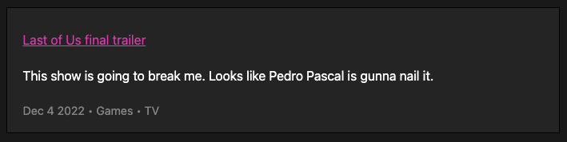

## Lite YouTube for Micro.blog

This plugin appends a [lite-youtube](https://github.com/paulirish/lite-youtube-embed) embed at the end of any post that includes a YouTube link (it also works with multiple links in one post).

### Example

**Before**:



**After**:


## Installation

1. Find [Lite YouTube for Micro.blog (TODO ADD LINK HERE)]() in the plug-in directory
2. Install to the site you want to install to and press install
3. Ta-da! It's installed

### Configuration

1. Go to _plug-ins_ and pressing settings next to _Lite YouTube for Micro.blog_
2. Set the class name on the element for the posts on your blog
3. Click _Update Settings_

If you're theme already includes the code below in the `head.html` file then everything should just work. If not, you can include the partial manually by adding the following to your `head.html` file under `Design > Edit Custom Themes > Your Theme`:

```
{{ partial "lite-youtube.html" . }}
```